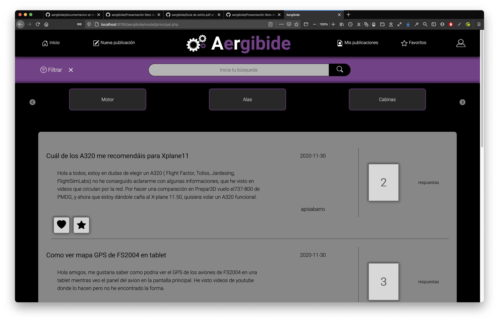
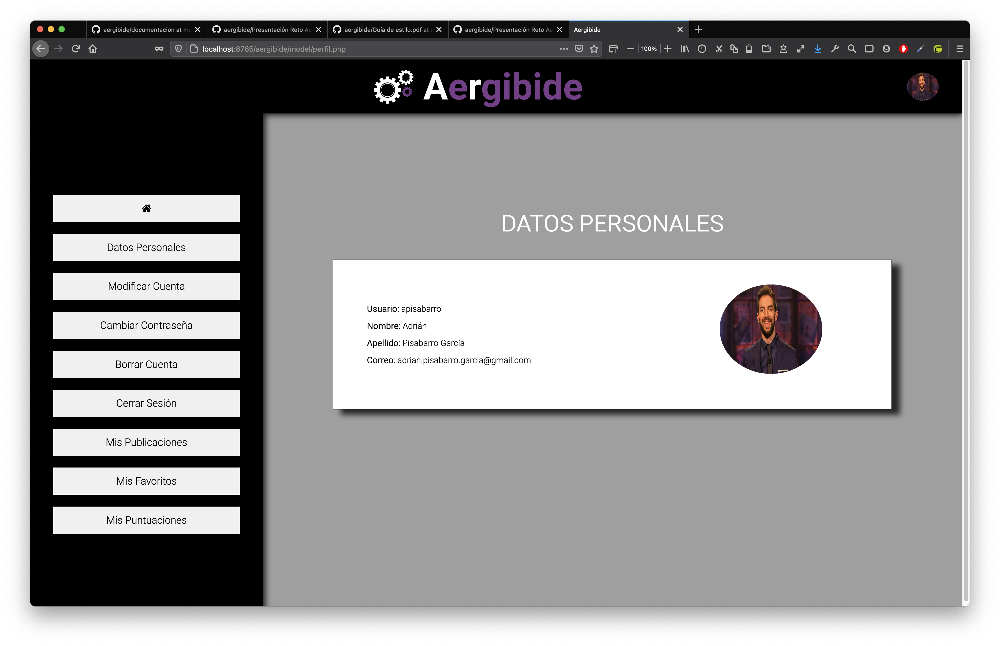
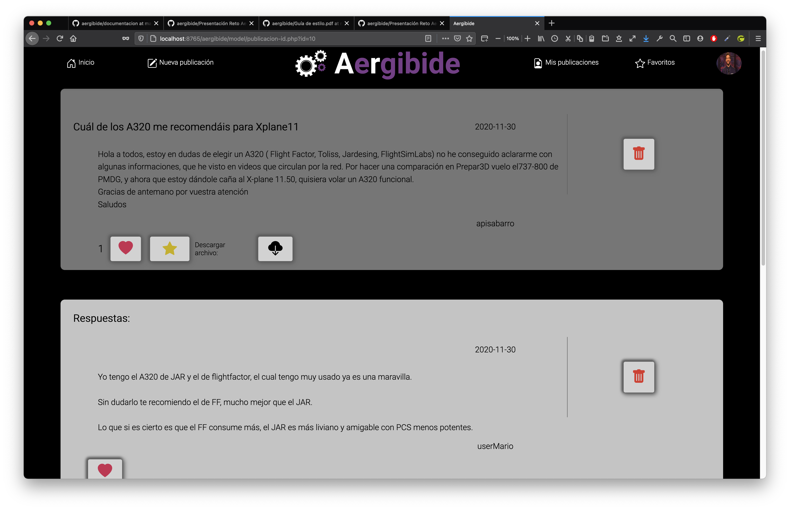
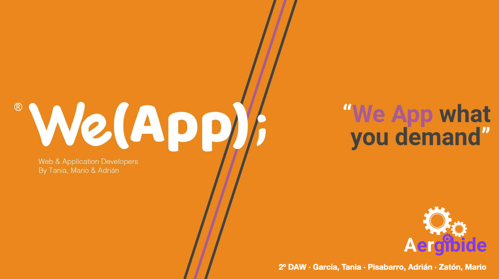

# Aergibide S.L
## Introuducción
Foro desarrollado por [WeApp](https://twitter.com/weappdev) para la empresa Aergibide S.L.   
Este portal tiene las siguientes funcionalidades:      

*  Registro/Login
*  Gestión de cuentas
*  Categorías
*  Subida de preguntas y respuestas
*  Subida de archivos en preguntas y respuestas (gestión de archivos)
*  Borrar y modificar preguntas
*  Borrar respuestas
*  Filtrado de preguntas
*  Me gusta (like) de preguntas y respuestas
*  Mis preguntas favoritas
*  Mis preguntas (o historial de mis propias preguntas)
*  Puntos obtenidos y nivel según el número de preguntas y respuestas hechas.
*  Montar un servidor basado en scripts de Apache, MySQL, PHP, FTP y SSH.

## Documentación
*  [Manual de Usuario](./documentacion/Documentación General.pdf)
*  [Guía de Estilo (Boceto, Mock Up, Colores, Fuentes, etc.)](./documentacion/Guía de estilo.pdf)
*  [Presentación Aergibide S.L. by WeApp](./documentacion/Presentación Reto Aergibide.pdf)

## Desarollador por
Desarrollador por WeApp: [Adrián](https://github.com/adrianpisabarrogarcia), [Mario](https://github.com/mariozaton01), [Tania](https://github.com/TaniaGarciaOlarte).   
  

## Capturas del Portal
 
 
 
 

## Logotipo de WeApp S. Coop.
 

